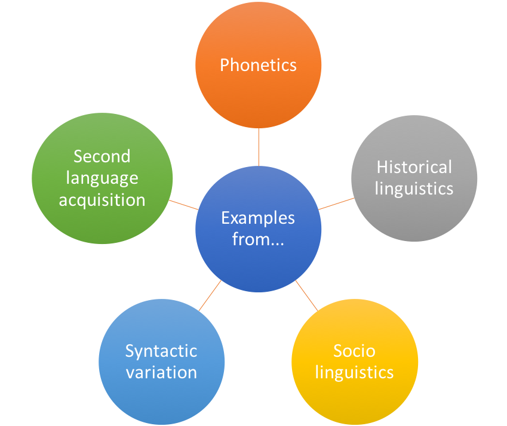
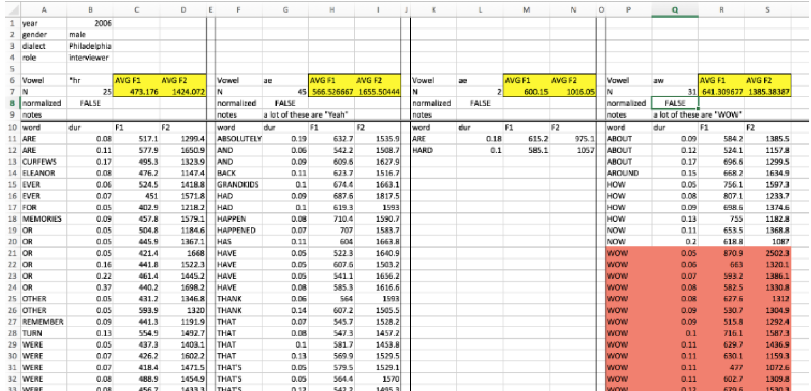

```{r setup, include=FALSE}
knitr::opts_chunk$set(echo = FALSE)
```

***
## Overview

This course is:

* an introduction to analysing large-scale linguistic data sets in R
* aimed at linguists working with quantitative data
* mainly going to focus on phonetic, sociolinguistic and reaction time datasets, but the principles can be applied to any subfield of any kind

***
## What this course is *not*

* An introduction to Natural Language Processing
* An introduction to corpus linguistics
* Discourse analysis, sentiment analysis etc.


***
## Schedule

* Today: Intro to course and to R
* Thursday: Data visualisation
* Next Tuesday: Basic statistical tests
* Next Thursday: Data wrangling, advanced visualisation, statistical tests and requests!

***
## What is your research?

* Who are you and what do you want to analyse?
* What is your dependent variable?
* What about independent variables?




***
# Introduction to R

***
## Why use R?

* R is the statistics software paradigm of our day
* It's free!
* It's platform independent
* Packages for everything (constantly being updated)
* All the cool kids use it

***
## This lesson's goals

* Work with an R notebook (simpler than working with R proper for now)
* Read in and manipulate data
* Make some figures

*** 
# R can be used as a calculator

***
## The difference between R and RStudio...
**"RStudio is like an Instagram filter over R, to make your R user experience better."**
- Joe Fruehwald ([R course](https://jofrhwld.github.io/teaching/courses/2017_lsa/))

- Check out Joe's [Workshop](https://blogs.ncl.ac.uk/ncllingconf/workshops/) at this year's Newcastle Postgraduate Conference in Linguistics

```{r, echo=FALSE,out.width="39%", out.height="15%",fig.cap="caption",fig.show='hold',fig.align='center'}
knitr::include_graphics(c("img/R.png","img/RStudio.png"))
```

***
## Why are we using R?

```{r, echo=FALSE,out.width="40%", out.height="100%",fig.cap="The trend of SPSS and R based on Google Scholar articles",fig.show='hold',fig.align='center'}
knitr::include_graphics(c("img/scholar90s.png","img/scholar2018.png"))
```


***
## Data files
* Need to be `.csv` or `.txt` NOT Excel
* Need to have one token per row

***  
## Bad data formatting for R
* Never organise your data like this:



***
# Demonstration: importing and data basics

***
## Importing data
```{r}
dialect_data = read.csv("HSS8005_dialectdata.csv")
```

* If you are importing `.txt` files, use `read.delim()`
* If you are importing `.csv` files, use `read.csv()`

* Also possible: 
```{r, eval = FALSE}
dialect_data = read.csv(file.choose())
```

* Double slashes for PC, single forward slashes for Mac

***
## General tips

* R is case sensitive (it will treat an `s` as a completely different character to `S`)
* Don't use spaces in your filenames and folders
* Softwrap your code by going to **Tools > Global Options > Code** and ticking **Soft-wrap R source files**. 

*** 
## Basics: data assignment
```{r, eval = TRUE}
x = 5
y = 2
x*y
```
*“There are only two hard things in Computer Science: cache invalidation and naming things.” — Phil Karlton*

For best practices on naming variables, checkout the [tidyverse style guide](https://style.tidyverse.org/syntax.html#object-names) by Hadley Wickham


***
## Factors and levels: `factors`
Our variables are called **factors** in R terminology.  
```{r}
dim(dialect_data)
colnames(dialect_data)
```

## Factors and levels: `factor levels`
Our variables are called **factors** in R terminology.  Each option for a factor is a **factor level**.
```{r}
levels(dialect_data$foot_strut)
```


***
##Simple functions: `head` and `tail`, `dim`
```{r}
head(dialect_data)
tail(dialect_data)
```

***
##Simple functions: `dim` and `colnames`
```{r}
dim(dialect_data)
colnames(dialect_data)
```


## Download the materials for today's class here


***
## Packages
* What are packages?
* The first time you use them, you will need to install the packages (you only need to do this once)
```{r, echo = TRUE, eval = FALSE}
install.packages("dplyr")
install.packages("ggplot2")
```

* Load the packages
```{r, echo = TRUE, eval = FALSE}
library(dplyr)
library(ggplot2)
```


