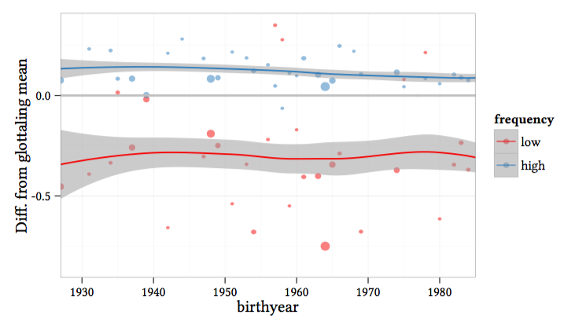

```{r setup, include=FALSE}
knitr::opts_chunk$set(echo = TRUE)
```

Welcome to the course website for HSS8005 Stream C Introduction to Quantitative Linguistics.



## Overview

This module is an introduction to analysing linguistic data in R.  

## Contact
Email: danielle.turton@newcastle.ac.uk

Please allow at least 2 working days for a response.  Note that Friday is my dedicated research day and I am not on email.

Office hours: Mon 3-4, Weds 11-1 (Percy 3.11A)

Phone: 0191 208-8092


## Useful stuff

* Joe Fruehwald's LSA [R course](https://jofrhwld.github.io/teaching/courses/2017_lsa/)
* More advanced: Page Piccinini's [R course](https://pagepiccinini.com/r-course/)
* Hadley Wickham on [Tidy Data](https://cran.r-project.org/web/packages/tidyr/vignettes/tidy-data.html)